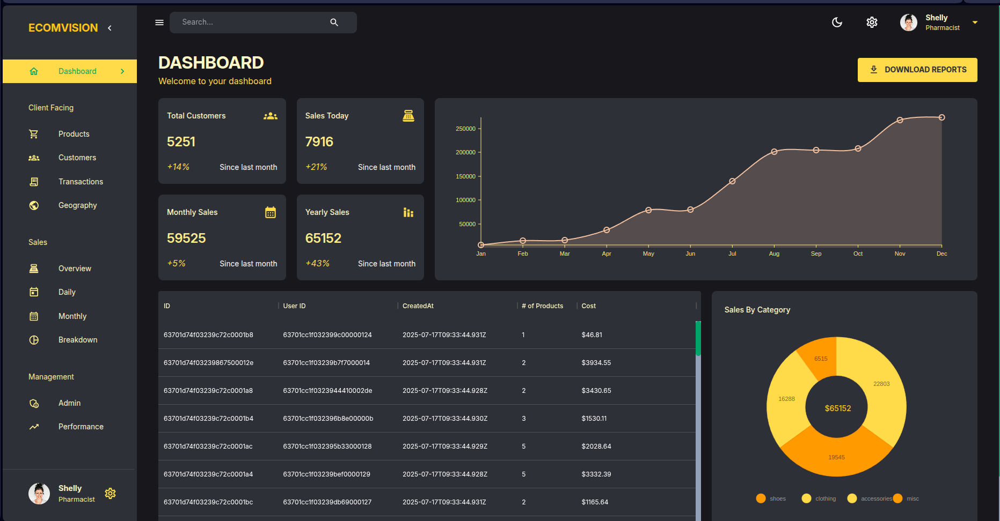

# Admin Dashboard MERN App

[](https://nodejs.org/) [](https://www.mongodb.com/) [](https://reactjs.org/) [](https://expressjs.com/) []()

A full‑stack MERN admin dashboard for managing products, customers, transactions, and visualizing sales analytics with dynamic charts.

## 📸 Demo
<p align="center">
  
</p>


## ✨ Key Features

- 📊 **Interactive Charts**: Visualize data with Nivo bar, line, and pie charts
- 🗂️ **Data Tables**: Sortable and filterable tables for products and transactions
- 👥 **Customer Insights**: View user activity and geographic distribution

- 📱 **Responsive Layout**: Works on desktop and mobile devices

## 🏗️ Project Structure

```
admin-dashboard-mern
├─ server/         # Express API and MongoDB models
├─ client/         # React frontend with Material UI
└─ images/         # Screenshots and assets
```

### Backend (`server`)

- **Node.js & Express**: REST API framework
- **MongoDB & Mongoose**: Data storage and schema validation
- **Controllers & Routes**: Organized API endpoints for products, users, transactions

### Frontend (`client`)

- **React**: Component-based UI development
- **Redux Toolkit**: Global state management
- **Material UI**: UI component library
- **Nivo Charts**: Data visualization with customizable charts

## 🚀 Quick Start

### Prerequisites

- Node.js (v18 or higher)
- MongoDB (local or Atlas)
- npm or yarn

### Setup & Run

```bash
# Clone repository
git clone https://github.com/mahmoudhusam/admin-dashboard-mern.git
cd admin-dashboard-mern

# Install dependencies
cd server && npm install && cd ../client && npm install

# Start backend server 
cd server && npm run dev

# In a separate terminal, start frontend 
cd client && npm run start
```

## ⚙️ Environment Variables

### Server

Create `server/.env`:

```bash
MONGO_URI=<your MongoDB connection URI>
PORT=<server port, e.g., 3001>
```
- `MONGO_URI`: Your MongoDB connection string.
- `PORT`: Port for the backend server (default: 3001).

### Client

Create `client/.env.local`:

```bash
REACT_APP_BASE_URL=http://localhost:<port number used in server/.env>
```
This ensures the frontend connects to your backend correctly.

This sets the base URL for the frontend to connect to your backend.
## 🛠️ Technologies Used

- **Backend**: Node.js, Express, MongoDB, Mongoose
- **Frontend**: React, Redux Toolkit, Material UI, Nivo Charts

---


